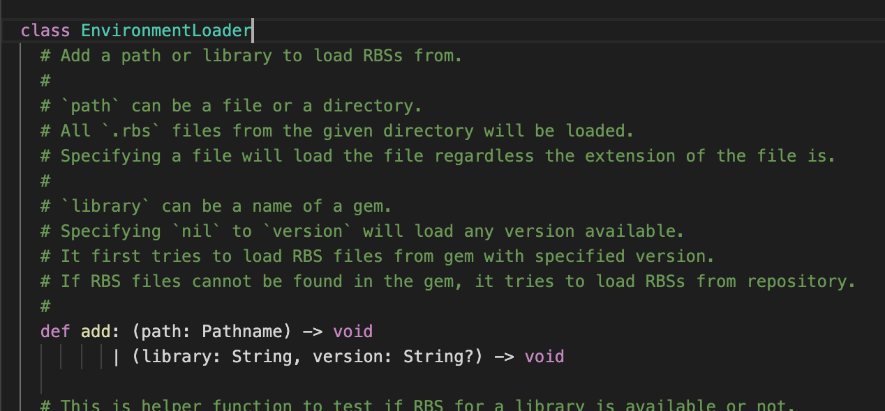

# RBS Syntax

RBS Syntax is a syntax support for [RBS](https://github.com/ruby/rbs) files. It implements basic syntax highlighting and indentation support.

RBS Syntax was originally developed by [@hanachin](https://github.com/hanachin) and transfered at Mar 25, 2021. The repository was `hanachin/vscode-ruby-signature` and the extension was distributed as [ruby-signature](https://marketplace.visualstudio.com/items?itemName=hanachin.ruby-signature). [@soutaro](https://github.com/soutaro) is the new maintainer.

